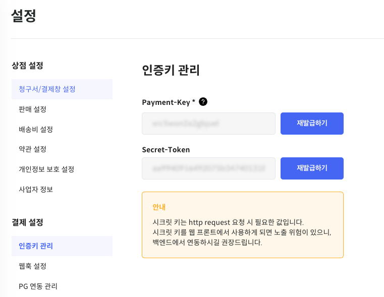
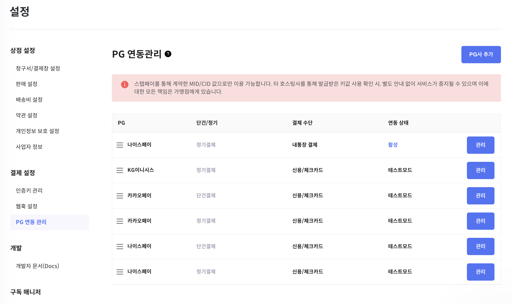

# 인증 가이드

스텝페이는 계정의 API Key를 사용하여 API 요청을 인증합니다. 요청에 인증키가 포함되어 있지 않거나 인증 키가 만료된 경우에는 [인증 오류](../error/error.md)를 반환합니다.
API 인증키는 스텝페이 포탈에 가입된 회원에게 제공됩니다.

## 연관 가이드

- [비관리형 결제 가이드](./07-2_Self_결제.md)에서 Payment-Key 연동하기

## 사전 준비 작업

- API 인증키를 발급받으려면 스텝페이 포탈에서 회원가입이 필요합니다.
- 결제 연동키 발급 후 스텝페이 포탈에서 [PG 설정](./07-0_결제.md#사전-준비-작업)이 필요합니다.

## 인증 키 설정

스텝페이에서 사용하는 인증 키는 두 가지 종류가 있습니다.
API 인증키는 스텝페이 포탈의 [설정] 메뉴의 '인증키 관리'에서 확인할 수 있습니다.



### 1. Secret-Token

Secret-Token은 V1 API 호출 시 필요한 인증 키입니다. Secret-Token은 스텝페이 포탈에 가입하면 별도의 절차 없이 모든 고객에게 생성되는 키 입니다.

> ⚠️ Secret-Token은 HTTP Request 요청 시 필요한 값입니다. 시크릿 키를 웹 프론트에서 사용하게 되면 노출 위험이 있으니, 백엔드에서 연동하시길 권장드립니다.

### 2. Payment-Key

Payment-Key는 [비관리형 결제](./07-2_Self_결제.md)를 사용하는 가맹점의 경우 ‘결제 SDK’를 사용하게 되며, 이때 Payment-Key가 필요합니다.  
Payment-Key를 사용하여 결제를 연동하는 경우, [PG 설정](./07-0_결제.md#사전-준비-작업)을 통해 사용하고자 하는 PG가 설정되어 있어야 합니다.
    

## API 인증

[스텝페이 V1 API](https://docs.steppay.kr/reference/createcustomer)를 사용하려면 HTTP Header에 Secret-Token을 전달해야 합니다.

```bash
curl --location 'https://api.steppay.kr/api/v1/subscriptions' \
--header 'Secret-Token:${Secret-Token}'
```
