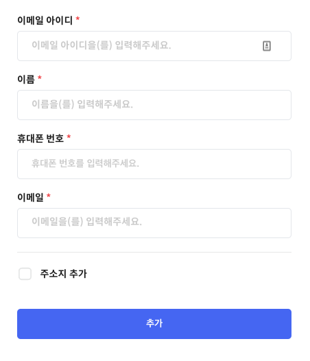
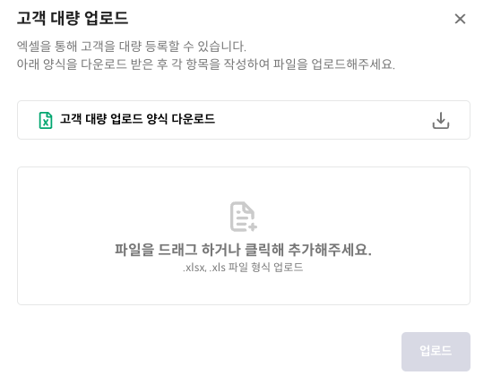
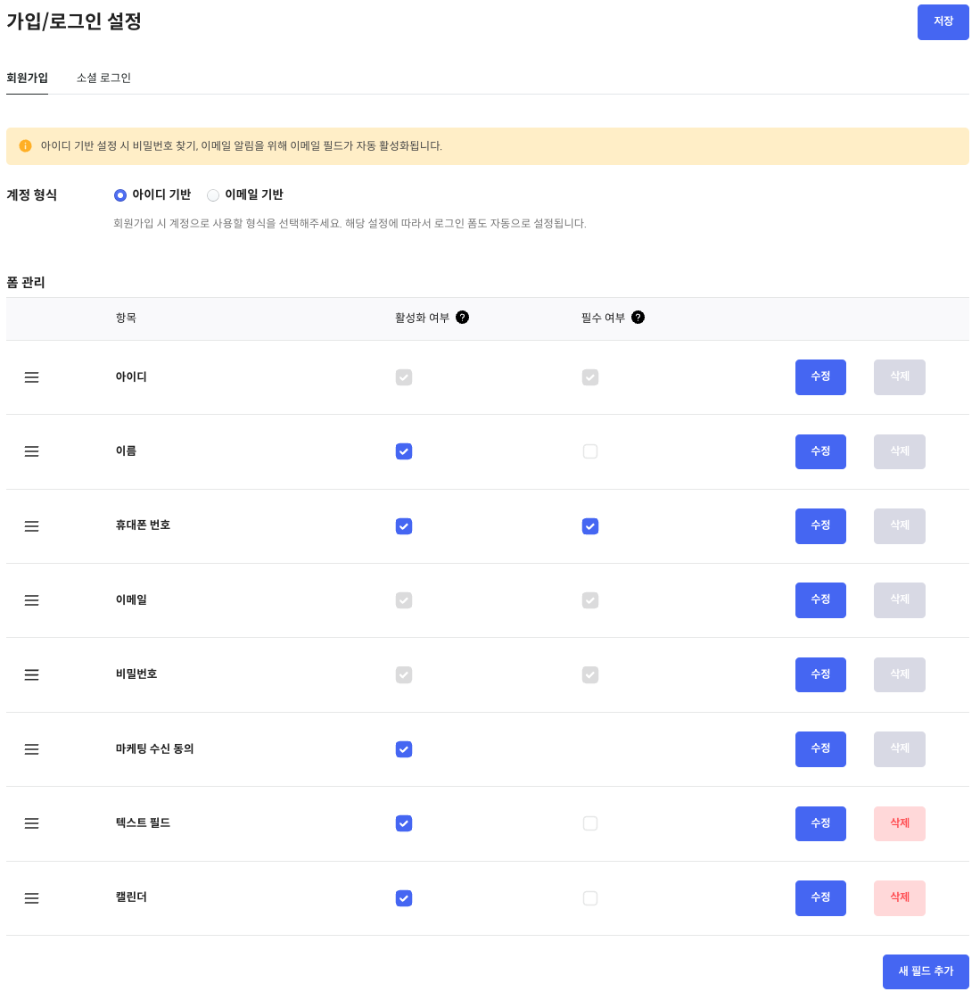

# 고객

고객은 일반적인 소비자로 실제로 결제를 수행하는 주체를 의미합니다. 이는 제품이나 서비스의 최종 사용자와 결제 주체가 다를 수 있습니다. 고객은 결제 책임을 지는 주체로서, 직접적으로 금융적 책임을 지게 됩니다.

고객 정보에는 연락처, 주소지, 주문 내역, 구독 내역, 마케팅 수신 동의 여부, [커스텀 필드](#커스텀-필드-설정-방법) 등 고객에 대한 정보가 저장됩니다. 또한, 현재 고객의 계정 상태(NORMAL, DORMANT) 에 대한 정보도 포함되어 있습니다.

<aside>
💡 고객의 계정 상태

| 상태 | 명칭 |
| --- | --- |
| NORMAL | 정상 |
| DORMANT | 휴면 |
</aside>

## 연관된 가이드

- [인증](./01_인증.md)
- [주문](./05_주문.md)
- [구독](./06_구독..md)

## 사전 준비 작업

- [인증](./01_인증.md)

## 휴면 고객

고객 계정이 휴면 상태로 전환되기 위한 기본 조건은 활성 구독이 없어야 합니다. 만약 고객이 최근 11개월 동안 주문이나 로그인을 하지 않았다면, 휴면 계정 전환 예정에 대한 알림을 고객의 이메일로 발송합니다. 그리고 만약 고객이 12개월 동안 주문이나 로그인을 하지 않는 경우, 고객 계정은 휴면 상태로 전환되며, 이에 대한 알림을 고객의 이메일로 보내게 됩니다.

## API 사용 예시

### POST 고객 생성

Example

```bash
curl --request POST \
     --url https://api.steppay.kr/api/v1/customers \
     --header 'Secret-Token: {Secret-Key}' \
     --header 'accept: */*' \
     --header 'content-type: application/json'
		 --data '
{
  "name": "demo",
  "email": "demo@demo.com"
}
'
```

<aside>
💡 **커스텀 필드를 포함한 고객 생성**

커스텀 필드를 사용하려면 먼저 [커스텀 필드 설정](#커스텀-필드-설정-방법)이 필요합니다. 설정이 완료되었다면, **`attributes`** 부분에 커스텀 필드에 대한 정보를 **`key-value`** 형식으로 입력합니다. 여기서 **`key`**는 설정된 커스텀 필드의 키 값이며, **`value`**는 JSON 형식으로 입력해야 합니다.

```bash
curl --request POST \
     --url https://api.steppay.kr/api/v1/customers \
     --header 'Secret-Token: {Secret-Key}' \
     --header 'accept: */*' \
     --header 'content-type: application/json'
		 --data '
{
	...
  "attributes": {
		"bfl9no1mg3w": "\"demo text\""
	}
'
```

</aside>

Response

201 Created (정상적으로 고객이 생성됨)

400 Bad Request (요청 파라미터 검증 실패)

## 스텝페이 포탈 사용 예시

스텝페이 포탈에서 고객을 생성하는 방법은 간단합니다.

1. [고객 관리 → 새 고객 추가](https://portal.steppay.kr/customers/new) 메뉴 이동
2. 아래 사진과 같이 필수 필드에 값을 채우고 추가 버튼 클릭 
    
    
    

💡 위의 필수 필드 외 커스텀 필드에 대한 설정은 아래 [커스텀 필드 설정](#커스텀-필드-설정-방법)에서 확인할 수 있습니다.


## 연동 가이드

- **가맹점에 기존 고객이 없는 경우**
    
    가맹점의 고객이 추가될때, 스텝페이 고객도 추가되어야 합니다. 즉, 가맹점의 고객과 스텝페이의 고객 정보가 동기화 되어야 합니다.
    

- **가맹점에 기존 고객이 있는 경우**
    
    기존 고객의 정보를 스텝페이 고객에 추가해야 합니다.
    
    - 엑셀 대량 업로드 기능 활용하여 고객 추가
        1. [고객 관리 → 전체 고객 내역](https://portal.steppay.kr/customers) 메뉴 이동
        2. `고객 대량 업로드` 버튼 클릭
        3. 아래 사진과 같이 고객 정보에 대한 엑셀 파일을 업로드하여 고객 추가
            
            
            
    - 고객 생성 API를 반복적으로 호출하여 고객 추가

## **Appendix**

### overview

스텝페이에서는 고객을 추가할 때, 다양하게 커스텀 할 수 있도록 빌더를 제공합니다.

기본적인 회원 가입 필드(아이디, 이름, 휴대폰 번호, 이메일, 비밀번호, 마케팅 수신 동의)의 필드명을 변경, 활성화/비활성화, 그리고 필수 입력 여부 설정을 통해 고객 데이터의 기본 구조를 자유롭게 설정할 수 있습니다.

또한, 고객의 추가 정보를 수집하고 저장하기 위해 커스텀 필드를 제공하며, 이 필드들은 필요에 따라 언제든지 추가, 수정, 또는 삭제가 가능합니다. 추가할 수 있는 커스텀 필드 타입은 아래와 같습니다.

| 타입 | 명칭 |
| --- | --- |
| TEXT | 텍스트 |
| EMAIL | 이메일 |
| PASSWORD | 비밀번호 |
| PHONE | 휴대폰 번호 |
| CHECKBOX | 체크박스 |
| DROPDOWN | 드롭다운 |
| CALENDAR | 캘린더 |
| NUMBER | 숫자 |
| COMMENT | 안내 문구 |

### 커스텀 필드 설정 방법

필드를 자유롭게 설정하려면 포탈에서 간단하게 설정할 수 있습니다.

1. [마이스토어 설정 → 가입/로그인 설정 → 회원가입](https://portal.steppay.kr/mystore-setting/form/join) 메뉴 이동
2. 아래 사진과 같이 필드들을 자유롭게 설정
    
    
    
3. 추가한 커스텀 필드에 대한 key 값을 복사하여 고객 생성 API 사용할 때 해당 key 값 사용하여 자유롭게 커스텀 필드 추가
    
    → 추후 기능 완료되면 반영해야함