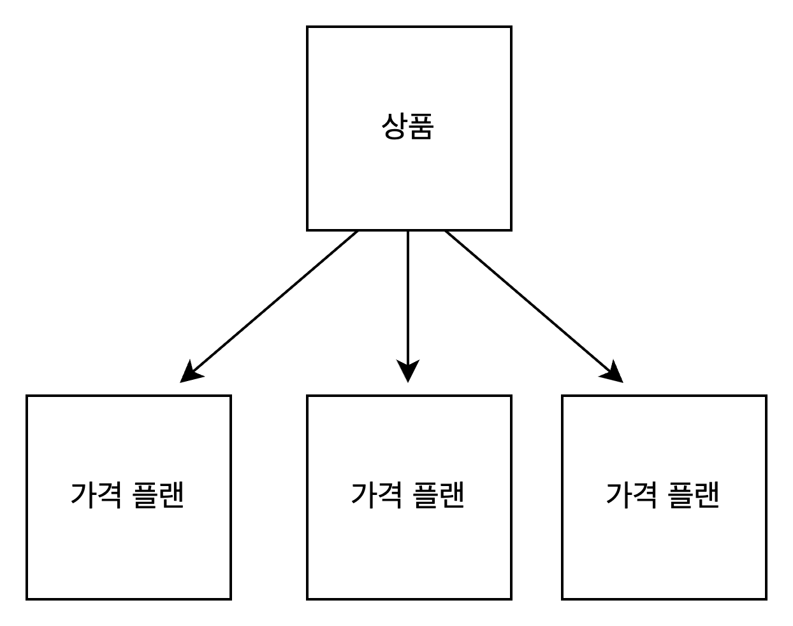
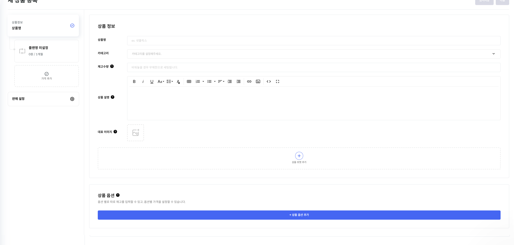

# 상품

💡 **본 항목은 스텝페이의 상품에 대한 개념을 설명합니다. 스텝페이에서 '상품'은 판매할 아이템과 그에 따른 가격 정책을 의미합니다. 이는 고객에게 제공되는 상품이나 서비스의 세부 사항을 정의합니다.**

# 연관된 가이드

- [가격 플랜](./04-0_가격플랜.md)

# 사전 준비 작업

- [인증](./01_인증.md)

# 상품 생성

## Overview

**상품 생성 기능은 사용자가 새로운 상품을 시스템에 추가할 수 있게 합니다. 이는 '상품 생성' API를 통해 수행됩니다. 하나의 상품에는 여러 가격 플랜을 설정할 수 있습니다. 가격 플랜에 관한 자세한 내용은 해당 [링크](%E1%84%80%E1%85%A1%E1%84%80%E1%85%A7%E1%86%A8%20%E1%84%91%E1%85%B3%E1%86%AF%E1%84%85%E1%85%A2%E1%86%AB%20@jblee%20a42d84639ddc4750941b9b460b38b66d.md)로 이동하시면 됩니다. 이 가이드에서는 상품을 생성하는 방법에 대해 설명합니다.**



**상품 과 가격 플랜 분리 이유?**

→ **하나의 상품에는 여러 가격 플랜이 생성 될 수 있습니다. 예를들어) 하나의 상품에 단건 가격플랜, 구독 가격플랜이 생성 될 수 있습니다. 또한 하나의 상품에 여러 구독 가격플랜을 설정할 수 있습니다. 예를들어) 주 결제, 월 결제, 년 결제를 따로 설정 할 수 있습니다.**

⛔ 상품 생성 API를 통해 상품 생성 후 반드시 [가격 플랜](./04-0_가격플랜.md)을 생성해야 합니다.


## 상품 종류

- 참고
    
    **스텝페이에서는 BOX(배송상품), SOFTWARE(무형의 상품, 서비스 포함), INVOICE(청구서 상품 생성) 세 가지 유형의 상품을 지원합니다.**
    
    - **BOX**: 실물로 판매되는 배송상품입니다. . 예를 들어, 책이나 가전 제품, 정기배송 상품이 이 유형에 해당합니다.
    - **SOFEWARE**: SaaS 서비스나 무형의 상품입니다. 예를 들어, 온라인 콘텐츠 구독이 이 유형에 해당합니다.
    - **INVOICE**: 빠르게 발송하기 위한 인스턴트 상품으로 청구서 페이지에서 생성되는 상품입니다.

## 상품 상태

- 참고
    
    우리의 시스템에서는 SALE, OUT_OF_STOCK, UNSOLD, WAITING_APPROVAL 네 가지 유형의 상품 상태를 지원합니다.
    
    - **SALE(판매)**:  주문 API 이용할 때 상품이용 가능  및  마이스토어 노출 상태 입니다.
    - **OUT_OF_STOCK(품절)**: 재고를 지정한 **품절**(상품의 재고가 없는)상태입니다. 재고 부족 시 구독 가격플랜을 가진 상품의 정기결제가 안될 수 있으므로 주기적으로 재고 관리를 하셔야합니다. 또한 조합형 옵션을 가진 상품에는 각각의 옵션의 재고도 설정 및 관리 할 수 있습니다.
    - **UNSOLD(미게시)**:  해당 상태일때 마이스토어 미노출 상태입니다.
    - **WAITING_APPROVAL(승인대기):**  몰인몰(앱스토어에서 몰인몰 구매 필요)에서 상위벤더의 승인을 대기중인 상태입니다.

## 상품 옵션 추가

**우리의 상품에는 다양한 옵션을 추가하는 기능을 제공합니다. 이 옵션은 사이즈, 색상, 패키지 유형 등 다양한 형태로 설정될 수 있습니다. 사용자는 상품을 생성할 때 이러한 옵션을 정의하고 추가할 수 있습니다. 옵션에는 두가지 타입이 있습니다.**

- **조합형 옵션:** 여러가지 옵션을 조합하여 여러 옵션을 생성할 수있게 합니다. 예를 들어, '사이즈'와 '색상'이라는 두 가지 옵션명이 있다면, 각각의 '사이즈' 옵션값 (라지, 미디움)과 '색상' 옵션값 (빨강, 노랑)이 서로 조합되어 총 4가지의 제품 옵션 (라지 빨강, 라지 노랑, 미디움 빨강, 미디움 노랑)을 생성합니다. 각각의 조합된 옵션에 대한 재고, 가격을 따로 관리 할 수 있습니다.
- **독립형 옵션:** 개발 예정
- 참고
    
    ### 상품 옵션 추가하는 법
    
    1. **옵션 정의**: 먼저, 상품 옵션을 정의해야 합니다. 각 옵션은 이름과 값으로 구성되며, 이는 JSON 형식으로 준비되어야 합니다. 예를 들어, 색상 옵션을 추가하는 경우, 옵션명은 "색상"이고 값은 "빨강", "파랑", "녹색" 등이 될 수 있습니다.
    - API Request 예시
        
        ```json
        "optionGroups": [{
        "type": "SELECT",
        "options": [{
          "name": "라지",
          "price": 500
        },{ 
          "name": "미디움",
          "price": 700
        }],
        "name": "사이즈"}],
        "name": "테스트 상품1",
        "useCombination": true
        ```
        
    1. **데이터 준비**: 준비된 옵션 데이터를 상품 데이터(**optionGroups)**에 포함시킵니다. 이 데이터는 '상품 생성' API 호출 시 함께 전송됩니다.
    2. **결과 확인**: API 호출의 응답을 확인합니다. 성공적으로 상품이 생성되고 옵션이 추가되면, 생성된 상품의 정보와 추가된 옵션 정보가 JSON 형태로 반환됩니다.

## 무료체험 설정

**무료 체험은 일, 주, 월, 년 단위로 설정 할 수 있으며 구독 가격플랜을 가진 모든 상품에는 무료 체험 상품으로 설정 등록할 수 있습니다.** 

- 참고
    
    **enabledDemo 데이터를 ‘true’로 지정 한 후  demoPeriod(체험 기간) demoPeriodUnit(체험 기간 단위)에 원하시는 데이터를 입력 하시면 됩니다.**
    

## 상품 재고 관리

**스텝페이의 모든 상품은 재고를 파악하고 설정 할 수 있습니다. 재고를 설정 할 필요없는 서비스의 경우 재고를 설정 하지 않아도 됩니다. 또한 상품 옵션을 설정 한 경우에도 각각의 옵션의 재고를 설정할 수 있습니다.**

- **단건 가격 플랜일 시 고객이 해당 상품을 주문 할때의 수량 만큼 차감, 구독 가격 플랜일 경우 첫 주문했을 때의 수량 만큼 차감 후 구독 주기가 되었을 때 첫 주문했을 때의 수량 만큼 자동 차감됩니다. 또한 구독 주기 이전에 주문 수량 변경 시 변경된 수량만큼 차감됩니다. 상품 재고가 없을 시 상품상태가 품절 상태로 변경됩니다.**
- **조합형 옵션을 설정한 경우 각각의 옵션 마다 재고를 지정 할 수 있습니다. 해당 옵션이 품절 되었을 때 해당 옵션의 상태가 품절 상태로 변하며 다른 옵션의 재고가 있을 시 상품의 상태가 품절 상태로 변하지 않습니다.**
- 참고
    
    **quantity 데이터를 통해 상품의 재고를 설정할 수 있습니다. ‘null’값 입력 시 재고가 무한대로 설정됩니다. 상품 옵션 또한 동일하게 해당 옵션의 quantity 데이터를 통해 재고를 설정할 수 있습니다.**
    

## 스텝페이 API 사용 예시

- **API** **Request 예시**
    
    ```json
    curl --request POST \
         --url https://api.steppay.kr/api/v1/products \
         --header 'Secret-Token: 'Secret-Key' \
         --header 'accept: */*' \
         --header 'content-type: application/json' \
         --data '
    {
      "type": "BOX",
      "status": "SALE",
      "demoPeriodUnit": "DAY",
      "name": "상품 명"
    }
    '
    ```
    

## 스텝페이 포탈 사용 예시

**[포탈] → [상품관리] → [새상품 등록]**



---

# 상품 목록 조회

## Overview

**상품 목록 조회 기능은 사용자가 상품 리스트를 확인 할 수 있게 합니다. 이는 '상품 목록 조회' API를 통해 수행됩니다.** 

## 상품 목록 파라미터(필수 X)

- 참고
    - **startDate (date-time)**: 조회 시작 시점을 지정합니다. 이 시점 이후에 생성된 상품만 조회됩니다.
    - **endDate (date-time)**: 조회 끝 시점을 지정합니다. 이 시점 이전에 생성된 상품만 조회됩니다.
    - **page (int32)**: 조회할 페이지 번호를 지정합니다. 0부터 시작합니다.
    - **size (int32)**: 한 페이지에 표시될 상품의 개수를 지정합니다. 기본값은 20입니다.
    - **sortDir (string)**: 결과의 정렬 방향을 지정합니다. 'ASC'는 오름차순, 'DESC'는 내림차순입니다. 기본값은 'DESC'입니다.
    - **sort (string)**: 결과의 정렬 기준값을 지정합니다. 기본적으로 상품의 생성 시점으로 정렬됩니다.
    - **keyword (string)**: 상품 이름에 대한 검색 키워드를 지정합니다. 입력된 키워드가 상품 이름에 포함된 상품만 조회됩니다.
    - **status (string)**: 상품의 상태를 지정합니다. 지정된 상태의 상품만 조회됩니다.

## API 사용 예시

1. **Prepare Your Data**: 원하는 위의 쿼리 파라미터를 입력합니다.
2. **Call the API**: 준비된 데이터를 포함하여 '상품 목록 조회' API를 호출합니다. 이 API는 **GET** 방식을 사용하며, API의 endpoint는 **`/api/v1/products`** 입니다.
3. **Check the Response**: API 호출의 응답을 확인합니다. 성공적으로 상품 리스트가 조회되면, 상품의 리스트 정보가 JSON 형태로 반환됩니다.

---

# 상품 상세 조회

## Overview

**상품 상세 조회 기능은 사용자가 상품 상세 정보를 확인 할 수 있게 합니다. 이는 '상품 상세 조회' API를 통해 수행됩니다.** 

## API 사용 예시

1. **Prepare Your Data**: 원하는 상품의 **상품** **code**를 준비합니다.
2. **Call the API**: 준비된 데이터를 포함하여 '상품 상세 조회' API를 호출합니다. 이 API는 **GET** 방식을 사용하며, API의 endpoint는 **`/api/v1/products/{code}`** 입니다.
3. **Check the Response**: API 호출의 응답을 확인합니다. 성공적으로 상품이 조회되면, 상품의 상세 정보가 JSON 형태로 반환됩니다.

---

# 상품 수정

## Overview

**상품 수정 기능은 사용자가 상품을 수정 할 수 있게 합니다. 이는 '상품 수정' API를 통해 수행됩니다.** 

## API 사용 예시

1. **Prepare Your Data**: 수정을 원하는 상품의 상품 **id**를 준비합니다.
2. **Call the API**: 준비된 데이터를 포함하여 '상품 수정' API를 호출합니다. 이 API는 **PUT** 방식을 사용하며, API의 endpoint는 **`/api/v1/products/{id}`** 입니다.
3. **Check the Response**: API 호출의 응답을 확인합니다. 성공적으로 상품이 수정되면, 수정된 상품의 정보가 JSON 형태로 반환됩니다.

---

# 상품 게시 상태 변경

## Overview

**상품 게시 상태 변경 기능은 사용자가 상품 상태를 수정 할 수 있게 합니다. 이는 '상품 게시 상태 변경' API를 통해 수행됩니다.** 

## 상품 게시 상태 변경 파라미터 (필수 O)

이 API는 다음의 쿼리 파라미터를 지원합니다:

- **status**: 변경할 상품 상태를 지정합니다.

## API 사용 예시

1. **Prepare Your Data**: 수정을 원하는 상품의 상품 **id**, **status**를 준비합니다.
2. **Call the API**: 준비된 데이터를 포함하여 '상품 게시 상태 변경' API를 호출합니다. 이 API는 **PATCH** 방식을 사용하며, API의 endpoint는 **`/api/v1/products/{id}/status`** 입니다.
3. **Check the Response**: API 호출의 응답을 확인합니다. 성공적으로 상품 상태가 수정되면, **"상품 삭제 성공”** 메세지를 반환합니다.

---

# 상품 삭제

## Overview

**상품 삭제 기능은 사용자가 상품을 수정 할 수 있게 합니다. 이는 '상품 삭제' API를 통해 수행됩니다.** 

## API 사용 예시

1. **Prepare Your Data**: 삭제를 원하는 상품의 상품 id를 준비합니다.
2. **Call the API**: 준비된 데이터를 포함하여 '상품 삭제' API를 호출합니다. 이 API는 **DELETE** 방식을 사용하며, API의 endpoint는 **`/api/v1/products/{id}`** 입니다.
3. **Check the Response**: API 호출의 응답을 확인합니다. 성공적으로 상품이 삭제되면, **"상품 상태 변경 성공”** 메세지를 반환합니다.

---

# TODO

- 상품이랑 가격이 왜 분리되어있을까?
- 무료체험 적용 기준
- 재고관리
- 상품 옵션