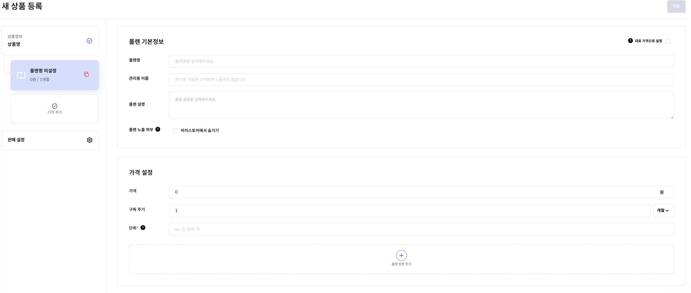

# 가격 플랜 가이드

스텝페이의 가격 플랜은 상품의 가격을 유연하게 설정할 수 있도록 가격 플랜을 제공합니다. 
가격 플랜은 크게 단건, 구독, 번들로 나뉘며 해당 유형을 인지하고 상품을 생성해야 합니다. 하나의 상품에는 여러 가격 플랜이 설정 가능합니다.
가격 플랜 위젯을 통해 다양한 형태의 가격 정책을 하나의 상품에 설정하여 필요에 맞게 적용할 수 있습니다.

## 연관된 가이드

- [인증 가이드](./01_인증.md)
- [상품 가이드](./03_상품.md)
- [사용량 기반 요금제 가이드](04-1_사용량.md)
- [계정수 기반 요금제 가이드](04-2_계정수.md)

## 사전 준비 작업

- [Secret-Token 확인하기](./01_인증.md#1-secret-token)

## 가격 플랜 유형
스텝페이의 가격 플랜은 크게 5가지 유형이 있습니다.

| Type        | Name   |
|-------------|--------|
| ONE_TIME    | 단건 요금제 |
| FLAT        | 구독 요금제 |
| BUNDLE      | 번들 요금제 |
| USAGE_BASED | 사용량 기반 |
| UNIT_BASED  | 계정수 기반 |

### 단건 플랜

단건 가격 플랜은 한 번의 단일 구매에 대한 설정입니다. 이는 일회성 제품이나 서비스에 적용되며, 이 옵션은 고객이 한 번만 청구되고 구독이 갱신되거나 금액이 재청구되지 않습니다.

### 구독 플랜

구독 가격 플랜은 고정된 요금의 구독 서비스를 의미합니다. 이 플랜은 고객에게 정기적으로 청구되는 서비스에 적합합니다. 예를 들어 쿠팡로켓 와우 또는 유튜브 뮤직과 같은 서비스에 사용될 수 있습니다.
V1 API를 통해 구독(FLAT) 가격 플랜을 생성하는 경우에는 구독 주기에 해당하는 recurring(object)에 대한 정보를 필수로 입력해야 합니다.

### 번들 플랜

번틀 가격 플랜은 여러개의 상품이나 서비스를 하나의 패키지로 묶어 판매하는 상품입니다. 번들 상품은 각각의 하위 아이템들의 가격은 무시되고 번들 전체 가격으로 설정됩니다. (단, 사용량 기반 가격 플랜을 제외) 
또한, `ontimeBundlePrice`(번들 단건 가격)값 추가 시 첫 결제 금액에서는 해당 가격이 포함되어 결제됩니다. 번들 플랜의 상품을 주문하면 번들에 포함된 하위 상품들이 주문 아이템에 추가됩니다.

## 가격 플랜 위젯
스텝페이에서는 다양한 가격 플랜 위젯을 제공하여 간편하게 가격 플랜을 생성할 수 있습니다.  

### ✔️ 첫 결제 할인

고객이 상품 첫 구매 시, 최초 주문 시에 할인가로 제공할 수 있습니다. 첫 결제 할인은 상품별로 지정 가능합니다.

### ✔️ 기본료/도입비/설치비

기본료, 도입비, 설치비가 필요한 경우에 해당 위젯을 추가하여 1회성 또는 정기적으로 추가 과금 할 수 있습니다.

### ✔️ 구독 종료되는 만기 지정

구독은 기본적으로 관리자 또는 고객이 구독을 취소하기 전까지 유지됩니다. 해당 위젯을 추가하면 구독 만기 날짜를 지정할 수 있습니다. 구독 만기 날짜가 도래하면 해당 구독은 자동으로 만료 처리가 됩니다.


### ✔️ 후불 결제

해당 위젯을 추가하면 상품에 대한 결제를 후불로 지급할 수 있으며, 결제 시점은 다음 결제 예정일입니다. 후불 결제 위젯을 사용하는 구독을 취소하는 경우에는 후불 결제가 한 번 일어난 뒤 구독이 취소됩니다.  

### ✔️ 사용량 기반

사용량 기반 요금제는 사용량에 따른 과금을 기반으로 합니다. Saas 서비스나 클라우드 스토리지와 같이 사용량이 늘어날수록 요금이 증가하는 서비스에 이 플랜이 사용됩니다.

### ✔️ 계정수 기반

계정수 기반 요금제는 건당 과금을 기반으로 합니다. 이 플랜은 특정 작업이나 API 호출 등 각 단위 액션에 대한 요금을 정의하는데 사용됩니다. 베이스 가격이 존재하므로, 단위 수에 따라 총 요금이 계산됩니다.

## 스텝페이 포탈 사용 예시

- [포탈] → [상품관리] → [새상품 등록] 메뉴로 이동합니다.
- 상품의 기본 정보를 입력하고 다음으로 이동합니다.
- 플랜 정보와 가격 설정, 플랜 위젯을 입력하고 저장합니다.

  


## 스텝페이 API 사용 예시

### 가격 플랜 생성

- Request
    ```bash
    curl --request POST \
         --url https://api.steppay.kr/api/v1/products/{product_id}/prices \
         --header 'Secret-Token: {Secret-Token}' \
         --header 'accept: */*' \
         --header 'content-type: application/json' \
         --data '
    {
        "plan": {
            "name": "가격플랜-단건",
            "description": ""
        },
        "type": "ONE_TIME",
        "price": 0,
        "unit": "건",
        "basicServing": 1000
    }
    '
    ```
- Response
  ```json
  {
      "id": 10064,
      "code": "price_oTuP3PA9O",
      "price": 0,
      "unit": "건",
      "planName": "가격플랜-단건",
      "planDescription": "",
      "type": "ONE_TIME",
      "enabledFirstSalePrice": false,
      "firstSalePrice": 0,
      "claimMethodType": "PRE",
      "whenToClaimType": "FIRST_PAYMENT",
      "billingDate": 1,
      "maximumPurchaseQuantity": 0,
      "membershipExpirationDate": 0,
      "membershipExpirationDateType": null,
      "setupOption": null,
      "options": [],
      "volumes": [],
      "additionalBilling": null,
      "recurring": null,
      "createdAt": "2023-06-19T01:45:42.470396",
      "modifiedAt": "2023-06-19T01:45:42.470396",
      "plan": {
          "name": "가격플랜-단건",
          "description": "",
          "detailDescription": null,
          "isHiddenFromShop": false,
          "adminName": null
      },
      "firstSale": {
          "enabled": false,
          "price": 0
      },
      "claim": {
          "methodType": "PRE",
          "whenToClaimType": "FIRST_PAYMENT",
          "billingDate": 1,
          "provideStartDay": null
      },
      "basicServing": 0,
      "bundlePrices": [],
      "onetimeBundlePrice": 0,
      "order": 0
  }
  ```