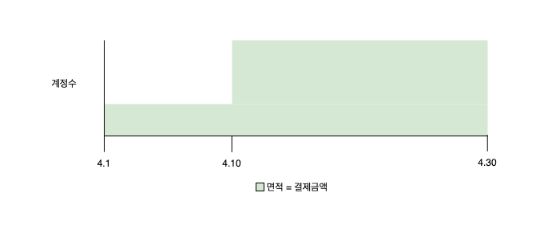
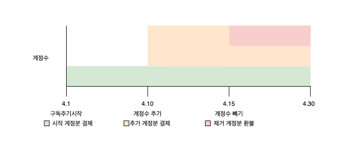
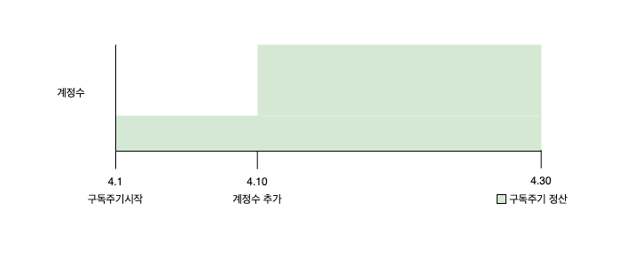

# 계정수

## 연관된 가이드

- [인증](./01_인증.md)
- [구독](./06_구독..md)
- [과금모델: 계정 수 기반](https://www.notion.so/00c79d38eddd4d9c9331d177071e9552?pvs=21)  → 공개된 메뉴얼에 설명되어 있는 부분이 포탈에는 반영되어 있지 않습니다. (포탈에서 계정수 추가 없음)

## 계정수 플랜이란?

**계정수 플랜**은 사용자의 계정 수에 따라 비용이 결정되는 가격 플랜입니다. 계정수 과금은 각 계정에 대해 사용한 일별로 계산되어 일할 과금됩니다. 계정수 기반 요금제는 구독이 갱신될 때 전월 누적된 계정수가 초기화 되지 않고 그대로 유지되어 갱신됩니다. 또한, 현재는 각 계정수 범위별로 다른 가격을 설정하는 구간별 가격 정책을 지원하지 않지만, 이 기능은 곧 추가될 예정입니다.

## 계정수 추가/삭제

사용자가 서비스를 구독하고 주문을 완료하면, 해당 주문의 정보를 통해 시작된 구독의 ID와 구독 항목 ID를 받을 수 있습니다. 이 ID 정보를 사용하여 [사용량 기록 API](https://docs.steppay.kr/reference/createunitrecords) 를 호출하면, 시스템은 전송한 계정 수 만큼의 사용량을 기록합니다.

구독과 구독항목: 설명링크

## **현재 정산액 확인**

[정산 API](https://docs.steppay.kr/reference/getusagerecords) 를 호출하면 현재까지의 사용량과 그에 따른 예상 결제 금액을 확인할 수 있습니다. 이 정보는 사용자의 Account 페이지에서 이용 가능한 정보로 제공될 수 있습니다.

남은 기간까지 일할 계산했는지?

## 청구금액

사용자의 계정에 활성화된 일수만큼 정산액을 계산하고, 해당 금액을 청구합니다. 

아래와 같이 4월 10일에 계정수가 추가된 경우 표시된 면적만큼 청구금액이 됩니다.

## 선불/후불

플랜을 생성하거나 업데이트 할 때 설정할 수 있습니다.

- **선불**: 서비스를 사용하기 전에 결제합니다. 계정수가 추가되면 주기의 남은 일수 만큼 일할 요금이 추가됩니다. ~~계정수가 삭제되면 주기의 남은 일수 만큼 일할 요금이 환불되도록 할 수 있습니다. 환불은 선택사항입니다.~~

  
    
- **후불**: 후불 계정수 플랜에서는, 주기동안 추가/삭제된 계정수에 대해서 일할 요금이 계산되어 정산일에 청구됩니다.

  
    

## 사용량 구독 취소

사용량 구독을 취소하는 경우, 플랜의 기본 금액에 대해 환불되며 이미 사용한 계정수에 대해서는 따로 환불 처리를 하지 않으면 후불 결제됩니다. 

사용량 환불을 원하는 경우에는 취소된 구독의 ‘관련 주문 탭’에서 사용량 주문을 환불 처리해야 합니다.

## 계정수 사용량 알림

### 결제 예정 알림

정해진 구독 주기 동안의 계졍 수가 일할 합산되어 결제되는 ‘계정수 기반 상품'의 경우, 결제 예정일 7일 전에 안내 메일이 발송됩니다. 고객은 계정 수가 얼마나 되고, 어떤 과금에 의하여 결제 금액이 과금되는지 상세 내역을 확인할 수 있습니다. 

### 주문 완료 알림

결제 완료시 주문 완료 메일이 발송됩니다. 고객은 사용량이 얼마나 되고, 어떤 과금에 의하여 결제 금액이 과금되는지 상세 내역을 확인할 수 있습니다.