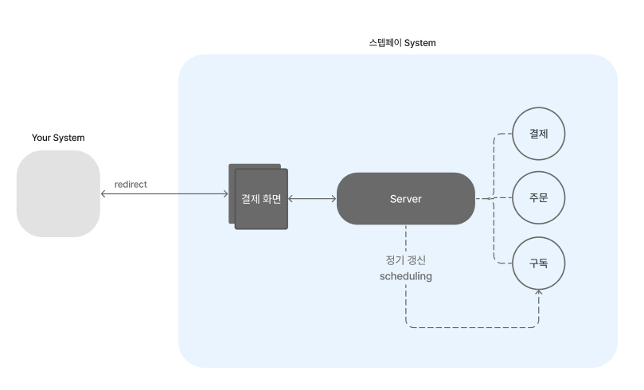
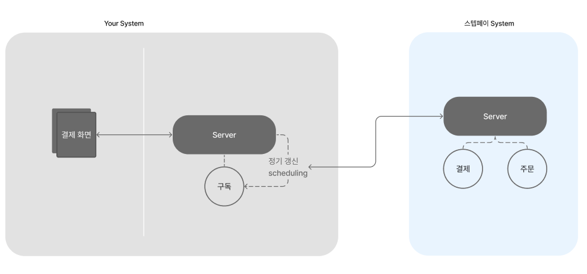

# 결제 @jung

# 결제

스텝페이 결제는 Managed 결제와 Self 결제를 제공해줍니다.

## Managed 결제

Managed 결제는 스텝페이의 결제화면을 사용하여 결제하는 방법입니다. 부가세 처리, 배송비 처리, 구독 생성, 결제 금액 검증, 스케쥴링 등 다양한 자동화 기능을 제공합니다.

[→ Managed 결제 바로가기](./07-1_Managed_결제.md)

[→ Managed 결제 Demo](https://api.steppay.kr/api/public/orders/test)

## Self 결제

Self 결제는 PG 결제만 편리하게 사용하고 싶을 때 적합한 결제 방법입니다. 결제 페이지에서 SDK로 편리하게 PG 연동할 수 있으며 빌링키만 발급해서 관리자가 스스로 원하는 시간에 스케쥴링 하여 원하는 금액 만큼 결제하실 수 있는 결제 방법입니다. 

[→ Self 결제 바로가기](./07-2_Self_결제.md)

# PG 설정하기

- 포탈 설정하러가기 ([https://portal.steppay.kr/setting/pg](https://portal.steppay.kr/setting/pg))

## 주의 사항

🚨 테스트 환경에서 생성된 구독들은 실 환경으로 변경하여도 실환경으로 적용되지 않습니다. 변경 후 새롭게 생성되는 구독들만 적용되게 됩니다.

## 지원하는 PG 및 결제수단

### 카카오페이 (*KAKAO*)

- 일반결제 (*CARD*)
- 빌링결제 (*CARD_BILL*)

### 나이스페이 (*NICE*)

- 일반결제 (*CARD*)
- 빌링결제 (*CARD_BILL*)
- 실시간 계좌이체 (*BANK*)
- 가상계좌 (*VBANK*)
- CMS 계좌이체 (*CMS_BILL*)

### 다날 (*DANAL*)

- 일반결제 (CARD)
- 빌링결제 (CARD_BILL)

### 토스 (*TOSS*)

- 일반결제 (CARD)
- 빌링결제 (CARD_BILL)
- 실시간 계좌이체 (*BANK*)
- 가상계좌 (*VBANK*)

### KG 이니시스 (*KG*)

- 일반결제 (CARD)
- 빌링결제 (CARD_BILL)
- 실시간 계좌이체 (*BANK*)
- 가상계좌 (*VBANK*)

### 블루월넛 (*BLUEWALNUT)*

- 일반결제 (CARD)
- 빌링결제 (CARD_BILL)
- 실시간 계좌이체 (*BANK*)
- 가상계좌 (*VBANK*)

### 페이플

- 일반결제 (CARD)
- 빌링결제 (CARD_BILL)

### 페이플 글로벌

- 일반결제 (CARD)
- 빌링결제 (CARD_BILL)

### 헥토파이낸셜

- 일반결제 (CARD)
- 빌링결제 (CARD_BILL)
- 내통장 단건결제 (CMS)
- 내통장 빌링 (CMS_BILL)

---

# TODO

- Managed, Self 그림 그리기
- 지원하는 결제수단- PG 부분에 특정 값들을 어디서찾아서 넣을 수 있는지 스크린샷 제공

---

문제점

- product-service 에서 Commit 이 실패, 구독 생성이 실패 등의 경우가 발생했을 때 결제로 환불 요청하는데 이 과정이 불완전함(모든 PG별로 테스트가 안정적이지않은?)
- 결제완료 → Product-service로 결제완료 rest 요청함 → 실패 발생시 카카오는

 → 결제 검증이전에 payment→ product 검증 과정이 필요

- [주문 생성](./05_주문.md)
- [PG 설정하기](./07-1_PG_설정.md)

---

[Managed 결제](./07-1_Managed_결제.md)
[Self 결제](./07-2_Self_결제.md)
