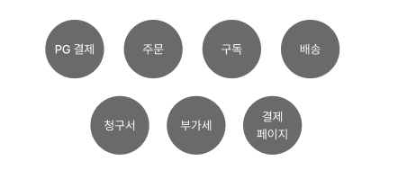
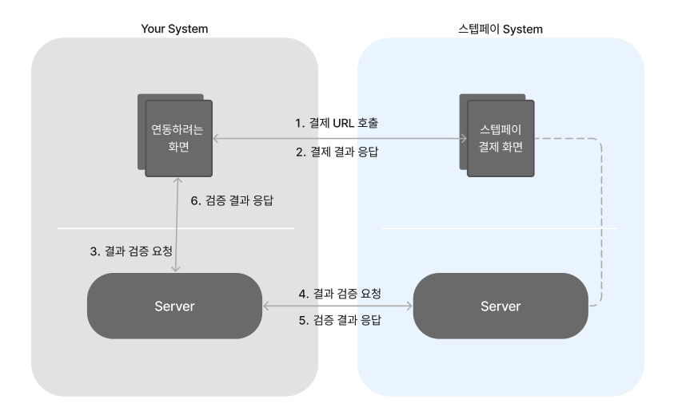
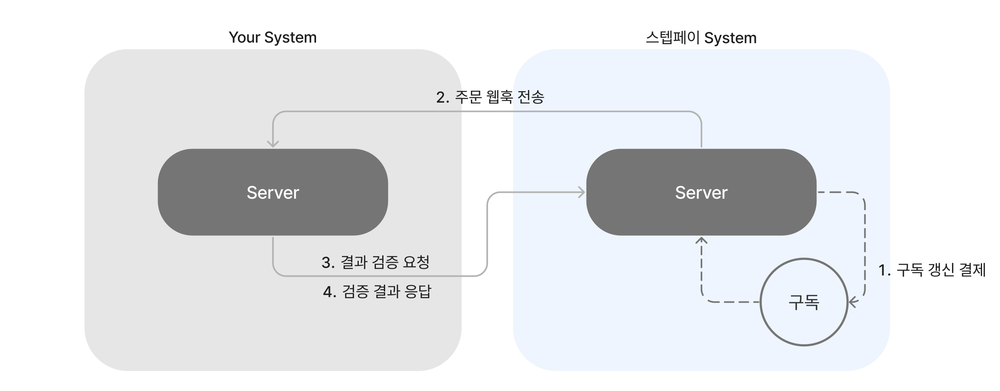

# Managed 결제

# Managed 결제



Managed 결제는 결제 페이지 부터 스케쥴링, 구독, 배송 등의 서비스를 제공해주는 결제 서비스입니다. 결제를 사용하기 위해서는 고객, 상품, 가격플랜, 주문을 생성해야 합니다.

## 연관된 가이드

[인증](./01_인증.md)
[주문](./05_주문.md)

- 결제 검증 및 에러 핸들링

## 사전 준비 작업


다음의 과정을 거쳐 결제 URL을 생성할 수 있습니다.

1. [고객 생성 하기](https://docs.steppay.kr/reference/createcustomer)
2. [상품 생성 하기](https://auth-system.steppay.kr/auth/realms/manager/protocol/openid-connect/auth?client_id=portal-client&redirect_uri=https%3A%2F%2Fportal.steppay.kr%2Fproducts&state=a3d3973f-2c69-47be-8e4f-6a7cf75168dd&response_mode=fragment&response_type=code&scope=openid&nonce=21402c36-71d0-498f-afc7-b7f7fb8c1c5c)
    - 상품 생성은 포탈의 [상품 빌더](https://auth-system.steppay.kr/auth/realms/manager/protocol/openid-connect/auth?client_id=portal-client&redirect_uri=https%3A%2F%2Fportal.steppay.kr%2Fproducts&state=a3d3973f-2c69-47be-8e4f-6a7cf75168dd&response_mode=fragment&response_type=code&scope=openid&nonce=21402c36-71d0-498f-afc7-b7f7fb8c1c5c)를 통해 생성이 가능합니다.
3. [가격 플랜 생성 하기](https://auth-system.steppay.kr/auth/realms/manager/protocol/openid-connect/auth?client_id=portal-client&redirect_uri=https%3A%2F%2Fportal.steppay.kr%2Fproducts&state=a3d3973f-2c69-47be-8e4f-6a7cf75168dd&response_mode=fragment&response_type=code&scope=openid&nonce=21402c36-71d0-498f-afc7-b7f7fb8c1c5c)
    - 가격 플랜은 포탈의 [상품 빌더](https://auth-system.steppay.kr/auth/realms/manager/protocol/openid-connect/auth?client_id=portal-client&redirect_uri=https%3A%2F%2Fportal.steppay.kr%2Fproducts&state=a3d3973f-2c69-47be-8e4f-6a7cf75168dd&response_mode=fragment&response_type=code&scope=openid&nonce=21402c36-71d0-498f-afc7-b7f7fb8c1c5c)를 통해 상품 생성 후 생성이 가능합니다.
4. [주문 생성](./05_주문.md)하기
    - 고객, 상품, 가격플랜이 생성됐다면 주문 생성이 가능합니다.
    - 응답으로 `orderCode` 를 알 수 있습니다. 이 `orderCode` 로 결제 URL요청이 가능합니다.
    - 주문 생성 응답으로 `idKey`를 전달합니다. 이 `idKey`로 결제 조회가 가능합니다.

## 최초결제



### 단계

STEP 1. 연동하려는 페이지에서 스텝페이 결제화면을 보여줍니다.

STEP 2. 성공 또는 실패했을 시 요청하신 URL로 REDIRECT되며, Query String에서 정보를 추출합니다.

STEP 3. 추출한 정보로 데이터가 올바른지 검증합니다.

STEP 4. 검증 결과에 따라 사용자에게 적절한 화면을 보여줍니다.

### Step1: 결제화면 보여주기

결제화면을 보여주는 방법입니다. 결제 화면을 호출해야 되는 타이밍에 아래의 방법을 따라 호출하실 수 있습니다. 결제 화면을 호출하면 스텝페이 내의 시스템에서 결제 절차를 진행합니다. 결제 과정에서 결제가 성공하거나 실패하면 결제화면 요청 시 전달주신 URL로 화면 Redicrect 됩니다. 성공 URL과 실패 URL을 준비해주세요.

세 가지 호출 방법 (Redirection, Popup, Iframe)을 설명합니다.

- **Redirection**
    1. 고객의 브라우저에서 결제화면으로 이동하게 합니다.
        
        ```jsx
        let params = {
            successUrl: `${successUrl}`,
            errorUrl: `${errorUrl}`
        };
        let url = new URL(`https://api.steppay.kr/api/public/orders/${orderCode}/pay`);
        url.search = new URLSearchParams(params).toString();
        // Redirection
        window.location.href = url;
        ```
        
- **Popup (Tab)**
    1. 브라우저에서 결제화면을 팝업 창에서 띄우거나 새로운 탭에서 띄웁니다.
        
        ```jsx
        let params = {
            successUrl: `${successUrl}`,
            errorUrl: `${errorUrl}`
        };
        let url = new URL(`https://api.steppay.kr/api/public/orders/${orderCode}/pay`);
        url.search = new URLSearchParams(params).toString();
        // New Tab or New Popup
        window.open(url, "_blank");
        ```
        
- **Iframe**
    1. Iframe 영역을 생성합니다.
    2. 브라우저에서 Iframe 태그의 src 값을 수정합니다.
        
        ```jsx
        let params = {
            successUrl: `${successUrl}`,
            errorUrl: `${errorUrl}`
        };
        let url = new URL(`https://api.steppay.kr/api/public/orders/${orderCode}/pay`);
        url.search = new URLSearchParams(params).toString();
        // iframe 안의 값을 수정합니다.
        document.querySelector("#myIframe").src = url; 
        // This will load the URL in the iframe
        ```
        
- **프로퍼티 설명**

| property | 타입 | 설명                                   |
| --- | --- |--------------------------------------|
| successUrl | String | 결제 성공 시 Redirect 받을 URL              |
| errorUrl | String | 결제 실패 시 Redirect 받을 URL              |
| orderCode | String | [주문 생성](./05_주문.md) 부분에서 생성된 orderCode를 추출 |

### Step2: 결제화면 Callback 처리

스텝페이의 결제화면에서 결제를 성공 또는 실패했을 때 `successUrl` 또는 `errorUrl` 로 Redicrect 되는데 이때 ‘**추가 파라미터**’가 붙게 됩니다. 이 ‘**추가 파라미터**’로 데이터가 올바른지 검증할 수 있습니다.

- `successUrl` REDIRECT Example
    
    ```
    [https://가맹점.com/success?order_id=${order_id}&order_code=${order_code}&status=](https://가맹점.com/success?order_id=1&order_code=abc&status=success)${status}
    ```
    
- 추가 파라미터

| property | 타입 | 설명               |
| --- | --- |------------------|
| order_id | Int | 스텝페이 주문 ID       |
| order_code | String | 스텝페이 주문 코드       |
| status | String | 결제 결과 (“success” | “error”) |

### Step3: 결제 검증

결제 결과를 검증할 수 있는 ‘결제 검증 API’를 준비해주세요. 

화면에서 발생한 Redirection이 스텝페이의 결제화면에서 리다이렉션됐는지 확인하는 과정입니다.

전달받은 ‘추가 파라미터’로 [주문 조회 API](https://docs.steppay.kr/reference/getorderdetail)를 호출합니다. 이후 정상적인 결제를 확인하는데 있어 paymentDate 프로퍼티 값이 null 이 아닌지 체크해야합니다. 

- ‘추가 파라미터’로 ‘결제 검증 API’호출 예시
    
    ```jsx
    <script>
    document.querySelector("#myButton").addEventListener("click", function() {
    		// step2 에서 추출한 '추가 파라미터'
    		var params = new URLSearchParams(window.location.search);
    
        fetch('결제 검증 API URL', {
            method: 'POST',
    				headers: {
    			    "Content-Type": "application/json",
    			  },
    			  body: JSON.stringify({
    			    orderCode: params["order_code"],
    			    orderId: params["order_id"],
    			    status: params["order_id"],
    			  }),
        })
        .then(response => response.json())
        .then(data => {
            // 결제 완료 또는 결제 실패 데이터 표시
        })
        .catch((error) => {
          console.error('Error:', error);
        });
    });
    </scrip
    ```
    
- ‘결제 검증 API’ 내에서 스텝페이로 주문 조회 API  예시 (Node)
    
    ```jsx
    const axios = require('axios');
    
    let config = {
      method: 'get',
      url: 'https://api.steppay.kr/api/payment/receipt/${idKey}',
      headers: { 
        'Secret-Token': '${secretToken}'
      }
    };
    
    axios.request(config)
    .then((response) => {
    	const receiptResponse = JSON.stringify(response.data);
    	// status 가 성공이면
    	if(status == "success" && receiptResponse.paymentDate !== null) {
    		// do some logic
    	}else {
    		// something went wrong
    	}
    	if(status == "error" && receiptResponse.paymentStatus == null) {
    		// do some logic
    	}else {
    		// something went wrong
    	}
    })
    .catch((error) => {
      console.log(error);
    });
    ```
    

## **정기 결제**



스텝페이에서 구독 갱신이 성공하면 [주문 웹훅](./08_웹훅.md)을 통해 결과를 전달합니다. 구독 상품을 이용하는 경우 [주문 웹훅](./08_웹훅.md)을 등록해야 실시간으로 결제 성공 이벤트를 받아보실 수 있습니다.

### 단계

1. 스텝페이에서 구독 갱신 일자에 맞춰 정기결제를 진행합니다.
2. 갱신 성공 시 [주문 웹훅](./08_웹훅.md)을 전송합니다.
3. 전달받은 주문 웹훅이 올바른지 검증하기 위한 주문 조회 API를 요청합니다.
4. 응답받은 주문 조회 결과로 전달받은 주문 웹훅을 검증합니다!