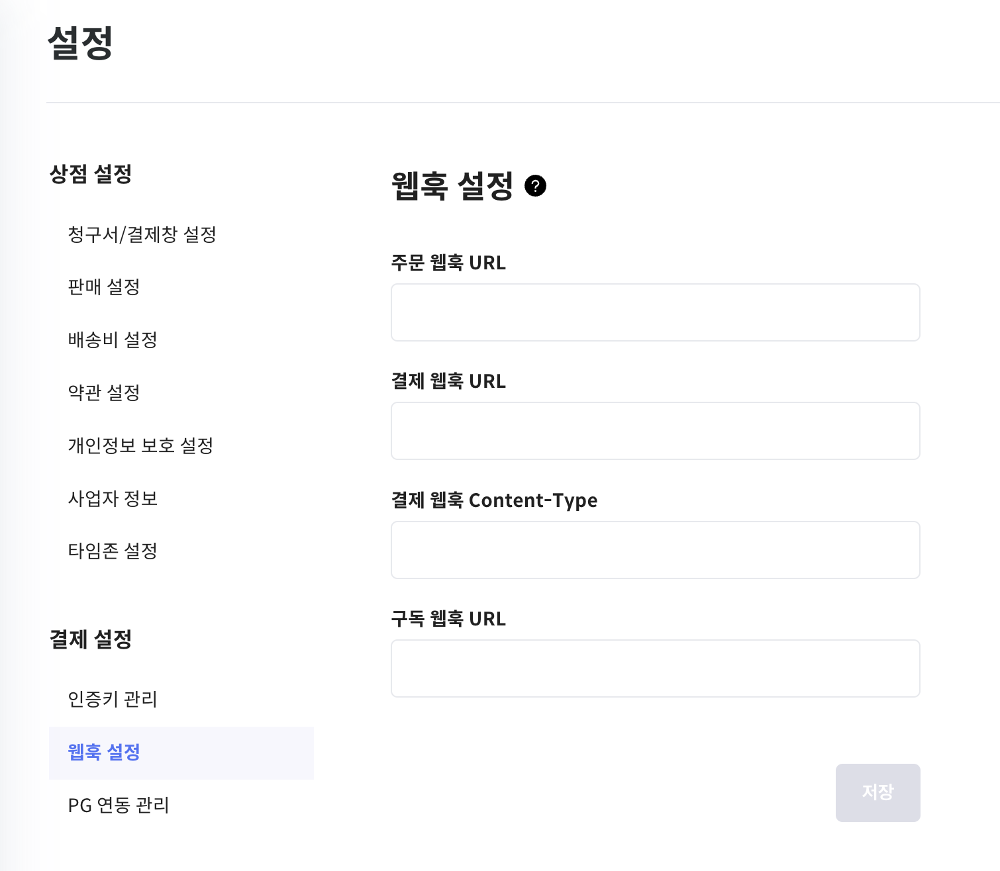
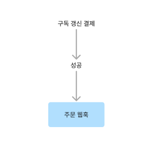
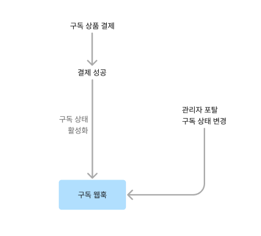

# 웹훅

웹훅이란 특정 이벤트가 발생했을 때, 실시간으로 이벤트에 대한 정보를 가맹점 서버로 전달하는 기능을 말합니다. 
예를 들어, 새로운 주문이 생성되거나, 구독 상태가 변경되었을 때 이를 즉시 가맹점에게 알려줍니다.

## 연관 가이드

- [주문 가이드](./05_주문.md)
- [구독 가이드](./06_구독..md)
- [결제 가이드](./07-0_결제.md)

## 사전 준비 작업

- 웹훅을 사용하려면 스텝페이 포탈에서 [ 설정 → 결제 설정 → 웹훅 설정]으로 이동해 웹훅을 등록해야 합니다.



## 웹훅 이벤트 유형

스텝페이의 웹훅 이벤트는 다음과 같습니다. 이벤트 유형별로 연동 설정이 가능하며, 각 이벤트는 특정 상황에서 발생합니다.

| 이벤트 유형 | 설명                                                  |
|--------|-----------------------------------------------------|
| 주문     | 갱신 주문이 성공했을 때 호출됩니다. 최초 주문은 호출되지 않습니다.              |
| 구독     | 구독의 상태가 변경되었을 때 호출됩니다. 최초 생성시에도 호출됩니다.              |
| 결제     | '스텝페이 결제 기능만 이용하는 경우'에만 사용 가능합니다. 결제가 발생했을 때 호출됩니다. |

> 🚨 웹훅은 인증 없이 동작하기 때문에 웹훅 엔드포인트 주소가 노출될 경우 악용될 가능성이 있습니다. 따라서 웹훅을 통해 전달받은 정보는 항상 백엔드에서 한 번 더 주문이나 결제 또는 구독에 대한 검증을 거친 후에 처리하시기 바랍니다.


## 연동 가이드

아래에서는 각 웹훅 이벤트에 대해 어떤 정보를 받을 수 있는지, 그리고 이 정보를 어떻게 사용해야 하는지에 대해 설명합니다.

### 주문 웹훅

갱신 주문이 성공했을 때 발생하며, 이를 통해 실시간으로 성공 알림을 받을 수 있습니다. 실패했을 때는 웹훅이 전송되지 않습니다. **단, 최초 주문시엔 발생하지 않습니다.**



### 요청 형식

| HTTP Method  | POST             |
|--------------|------------------|
| Content-Type | application/json |

### 웹훅 본문

| Feild       | Type     | Required | Description |
|-------------|----------|----------|-------------|
| webHookType | String   | 필수       | 구독 번호       |
| orderId     | Long     | 필수       | 주문 번호       |


```json
{
  "webHookType": "PAYMENT",
  "orderId": 1
}
```

#### 웹훅 타입

| 상태                   | 설명                                   |
|----------------------|--------------------------------------|
| PAYMENT              | 결제 완료                                |
| VBANK                | 가상계좌 발급 완료                           |
| CANCELED             | 결제 취소 완료                             |
| USER_CANCELED        | 결제창에서 취소버튼을 눌렀을 때                    |
| FAILED               | 결제 실패                                |
| CMS                  | CMS로 최초 결제                           |
| BILLKEY (deprecated) | 결제 완료 (0원인 경우)<br>-`PAYMENT` 로 변경 예정 |

### 구독 웹훅

구독 상태 변경 웹훅은 구독의 상태가 변경되었을 때 발생합니다. 구독의 상태가 활성화, 일시정지, 만료 등으로 변경되었을 때 실시간으로 이를 알 수 있습니다. 구독 최초 생성 시에도 웹훅이 발생합니다.



### 요청 형식

| HTTP Method   | POST              |
|---------------|-------------------|
| Content-Type  | application/json  |

### 웹훅 본문

| Feild  | Type   | Required | Description |
|--------|--------|----------|-------------|
| id     | Long   | 필수       | 구독 번호       |
| status | String | 필수       | 구독 상태       |


#### 구독 상태

| 구독 상태          | 설명         |
|----------------|------------|
| ACTIVE         | 활성화        |
| UNPAID         | 결제 실패      |
| PENDING_PAUSE  | 일시정지 예정    |
| PAUSE          | 일시 정지      |
| PENDING_CANCEL | 취소 예정      |
| EXPIRED        | 구독 만료      |
| CANCELED       | 사용자에 의한 취소 |


```json
{
  "id": 1,
  "status": "ACTIVE"
}
```