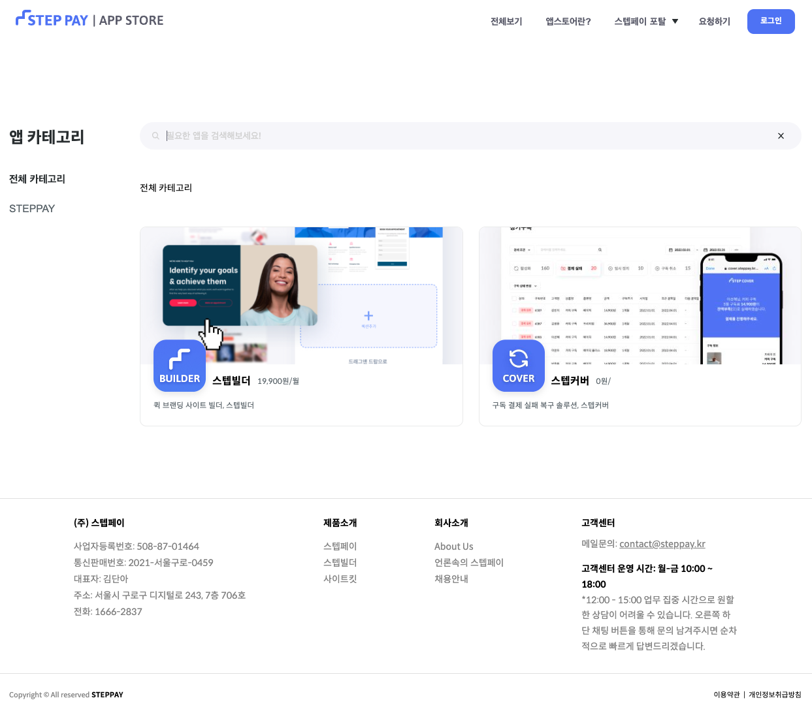
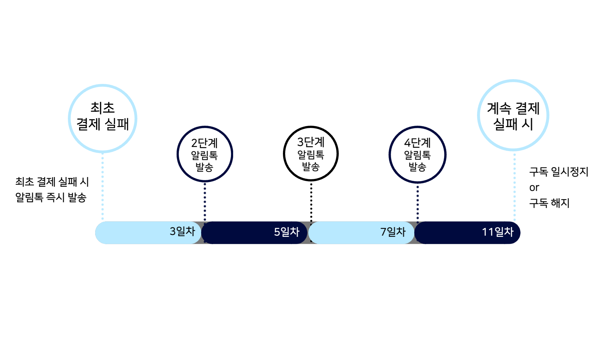
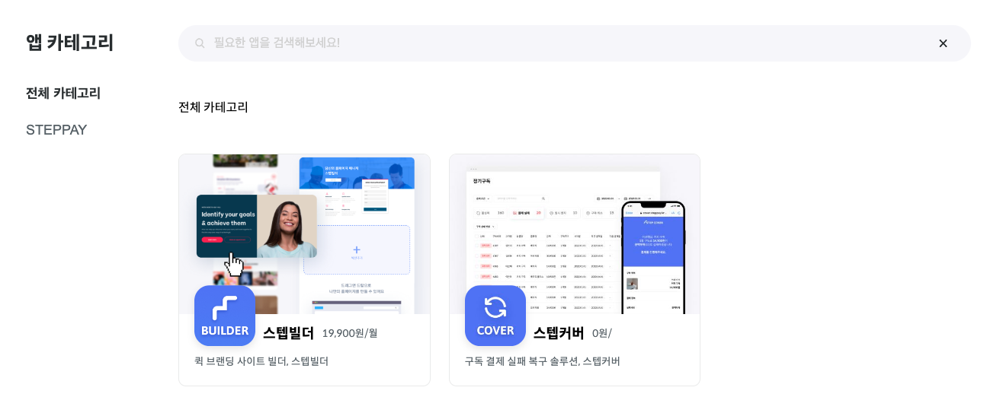
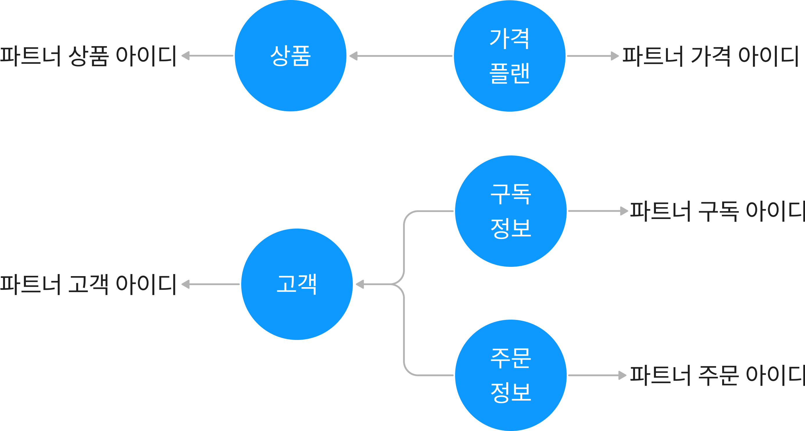
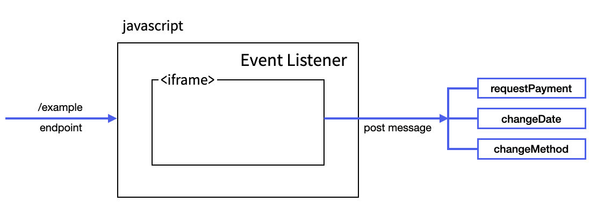

# 애드온 가이드

스텝페이 애드온은 새로운 비즈니스 형태에 필요한 앱을 통합하여 스텝페이 기능을 확장할 수 있도록 도와줍니다. 



## 스텝커버

스텝커버는 결제 복구를 도와주는 애드온 입니다. 정기 결제의 결제가 실패했을 경우 사용자가 빠르게 결제 실패를 해결할 수 있도록 도와줍니다. 스텝커버는 사용자에게 알림톡을 실패한 결제건에 대하여 결제할 수 있는 복구 페이지로 안내합니다. 사용자는 복구 페이지로 접속하여 결제하거나 결제일을 변경할 수 있습니다.
스텝커버 애드온은 다음과 같은 절차를 통해서 결제 복구를 시도합니다.
최초 결제 실패 시 알림톡을 발생합니다. 3일 이내에 결제 복구가 되지 않는다면 2단계 알림톡을 발송합니다. 이후에도 결제 복구가 되지 않는다면 4단계까지 알림톡을 발생하고, 계속 결제가 되지 않는다면 구독을 일시정지하거나 해지하게 됩니다. 



## 연동 방법

스텝커버는 두 가지 환경에서 연동하여 사용 가능합니다.

1. 스텝페이의 상품 빌더를 사용하여 구독 상품을 판매중이라면 별도의 개발 없이 복구 솔루션을 사용 가능합니다.
2. 스텝페이를 사용하지 않고 별도의 결제 시스템을 구축한 상태에서 스텝커버만 사용한다면 추가적인 개발이 필요합니다.

다음은 스텝페이의 상품 빌더를 사용하는 경우와 별도의 결제 시스템을 구축한 경우에 대하여 각각 연동하는 방법을 설명합니다.

### 스텝페이의 상품 빌더를 사용하여 연동하기

스텝페이의 상품 빌더를 사용하는 경우, 스텝커버 애드온과 자체적으로 통합되어 있으므로 추가적인 연동 작업을 할 필요가 없습니다. 
앱스토어에서 스텝커버를 활성화하면 스텝커버와 연동됩니다. 

1. [스텝페이 앱스토어](https://appstore.steppay.kr)에 접속합니다.
2. 우측 상단 ‘로그인’ 버튼을 클릭하여 관리자 계정으로 로그인합니다. 
3. 앱스토어에서 스텝커버 항목 선택 후 ‘활성화’ 버튼 클릭합니다.



### 별도의 결제 시스템을 구축하여 연동하기

스텝페이의 상품 빌더를 사용하지 않는 경우, 스텝커버에서 결제와 관련된 정보를 알 수 있도록 결제와 관련된 정보를 API를 통해서 등록해주셔야 합니다. 
또한, 복구 페이지를 연동하여 사용자가 알림톡을 통해 접속할 수 있도록 해야합니다. 이를 위해서는 복구 페이지의 주소를 설정해주어야 합니다.
이 글에서는 `파트너`는 현재 운영 중이신 커머스 환경을 의미합니다. 예를 들며, 파트너 주문 아이디는 운영 중이신 커머스 내에서 관리하고 있는 주문 아이디입니다. 

스텝커버를 별도의 결제 시스템을 구축한 환경에서 사용하기 위해서는 다음 과정이 필수적으로 이루어져야 합니다.

- Secret-Token 발급 및 앱스토어에서 스텝커버 애드온 활성화
- 스텝커버와 현재 운영 중인 커머스 데이터 동기화 
- 알림톡을 통해 접속할 복구 페이지 주소 설정
- 복구 페이지 연동 
- 복구 시나리오 시작 설정

스텝커버 애드온을 사용하기 위해서는 다음 작업을 통해서 운영 중인 커머스 데이터 동기화를 수행해야합니다.

- 고객 정보 등록
- 상품 정보 등록
- 가격 플랜 정보 등록
- 주문 정보 등록
- 구독 정보 등록

각 작업에 대한 연관 관계는 아래와 같습니다.


> 주의사항
> 파트너 사에서 관리하고 있는 아이디와 스텝커버에서 관리하고 있는 아이디 구분을 해야합니다.

파트너 사의 상품, 고객, 가격, 주문, 구독 아이디는 스텝 커버에서 관리하고 있는 상품, 고객, 가격, 주문, 구독에 포함하여 스텝커버에서 관리될 수 있도록 해야합니다. 
가격 플랜은 상품을 가지고 있고, 구독 정보와 주문은 고객을 가지고 있습니다.
스텝커버를 사용하기 위해서는 다음과 같은 5 단계의 과정을 수행하여 운영 중인 커머스 데이터 동기화를 진행합니다.

### STEP 1: 고객 정보 등록 

```bash
curl --request POST \
     --url https://api.steppay.kr/api/v1/cover/customer \
     --header 'accept: */*' \
     --header 'content-type: application/json' \
		 --header 'Secret-Token: <Your Secret-Token>' \
     --data '
{
  "name": "김길동",
  "email": "gildong@domain.com",
  "phone": "01012345678",
  "partnerCustomerId": "10424"
}
'
```

### STEP 2: 상품 정보 등록

```bash
curl --request POST \
     --url https://api.steppay.kr/api/v1/cover/product \
     --header 'accept: */*' \
     --header 'content-type: application/json' \
		 --header 'Secret-Token: <Your Secret-Token>' \
     --data '
{
  "name": "상품이름",
  "featuredImageUrl": "https://cdn.image.com/example.png",
  "partnerProductId": "512"
}
'
```

### STEP 3: 가격 플랜 정보 등록

`productId` 는 STEP 2에서 얻은 스텝커버의 상품 번호입니다.

```bash
curl --request POST \
     --url https://api.steppay.kr/api/v1/cover/price \
     --header 'accept: */*' \
     --header 'content-type: application/json' \
		 --header 'Secret-Token: <Your Secret-Token>' \
     --data '
{
  "name": "1개월 구독권",
  "partnerPriceId": "128",
  "productId": 10,
  "price": 10000,
  "recurringInterval": "MONTH",
  "recurringIntervalCount": 1
}
'
```

### STEP 4: 주문 정보 등록

`customerId` 는 STEP 1에서 얻은 스텝커버의 고객 번호입니다.

```bash
curl --request POST \
     --url https://api.steppay.kr/api/v1/cover/order \
     --header 'accept: */*' \
     --header 'content-type: application/json' \
		 --header 'Secret-Token: <Your Secret-Token>' \
     --data '
{
  "items": [
    {
      "priceId": 10,
      "quantity": 1
    }
  ],
  "paymentGateway": "NICE",
  "customerId": 7,
  "amount": 10000,
  "amountReturned": 0,
  "partnerOrderId": "1002"
}
'
```

### STEP 5: 구독 정보 등록

`customerId` 는 STEP 1에서 얻은 스텝커버의 고객 번호입니다.

```bash
curl --request POST \
     --url https://api.steppay.kr/api/v1/cover/subscription \
     --header 'accept: */*' \
     --header 'content-type: application/json' \
		 --header 'Secret-Token: <Your Secret-Token>' \
     --data '
{
  "recurringInterval": "MONTH",
  "customerId": 7,
  "currentPeriodStart": "2023-01-01T12:00:00Z",
  "currentPeriodEnd": "2023-01-31T12:00:00Z",
  "partnerSubscriptionId": "14",
  "recurringIntervalCount": 1
}
'
```

### 복구 페이지

알림톡에서 복구 페이지 링크를 클릭했을 때 보여지는 복구 페이지입니다.

1. 알림톡을 통해 접속할 복구 페이지 주소 설정
2. 복구 페이지 연동

   

- iframe을 사용해서 복구 페이지를 표시
    - URL로 전달되는 파라미터를 iframe으로 전달하여 복구 페이지를 표시합니다.
    - [iframe 으로 표시 가능한 페이지](https://docs.steppay.kr/docs/iframe-%ED%98%B8%EC%B6%9C-url-%EB%B0%8F-%ED%8C%8C%EB%9D%BC%EB%AF%B8%ED%84%B0)
- message event listener를 사용해서 iframe의 message를 처리
    - 복구 페이지에서 발생하는 사용자 요청이 message로 전달됩니다.
- message 종류
    - payment-complete: 결제 완료
    - payment-failed: 결제 실패
    - change-date: 결제일 변경 요청
    - change-method: 결제수단 변경 요청
    - redirect: 홈으로 이동
- [message 파라미터 및 상세정보](https://docs.steppay.kr/docs/iframe-%ED%98%B8%EC%B6%9C-url-%EB%B0%8F-%ED%8C%8C%EB%9D%BC%EB%AF%B8%ED%84%B0)
- 사용자가 요청한 내용에 따라서 다음과 같이 동작하도록 만들기
    - 결제 완료: 비활성화된 서비스를 다시 활성화 시킴
    - 결제 실패: 결제 실패에 대한 안내
    - 결제일 변경: 결제일을 변경하고 변경된 결제일에 다시 결제 시도
    - 결제수단 변경 요청: 정기결제용 idKey를 업데이트
        - 결제에 사용한 idKey는 token 값을 이용해 [idKey 알아내기 API](https://docs.steppay.kr/reference/getidkey)를 호출하면 받을 수 있습니다.
    - 홈으로 이동: 홈페이지로 이동

### 복구 시나리오  

복구 시나리오를 시작하는 다음과 같이 두 가지 방법이 있습니다.

1. [복구 시작 API](https://docs.steppay.kr/reference/startrecovery-1)를 호출하여 복구 시나리오를 진행합니다.

  `subscriptionId` 와 `orderId` 의 값은 스텝커버와 커머스 데이터 동기화 할 때 스텝커버에서 생성된 아이디입니다.
  [STEP 4: 주문 정보 등록](#step-4--주문-정보-등록)과 [STEP 5: 구독 정보 등록](#step-5--구독-정보-등록) 각각 응답에서 얻을 수 있습니다.
  
  ```bash
  curl --request POST \
       --url https://api.steppay.kr/api/v1/cover/recovery \
       --header 'accept: */*' \
       --header 'content-type: application/json' \
           --header 'Secret-Token: <Your Secret-Token>' \
       --data '
  {
    "subscriptionId": 3,
    "orderId": 6
  }
  '
  ```

2. [주문 정보 등록 API](https://docs.steppay.kr/reference/createorder-1) 호출 할 때 `paymentFailed` 값을 true로 지정하여 복구 시나리오를 진행합니다.

  [STEP 4: 주문 정보 등록](#step-4--주문-정보-등록) 과정 진행 할 때, 결제 실패가 일어난다면 복구 시나리오가 진행될 수 있도록 합니다.
  
  ```bash
  curl --request POST \
       --url https://api.steppay.kr/api/v1/cover/subscription \
       --header 'accept: */*' \
       --header 'content-type: application/json' \
           --header 'Secret-Token: <Your Secret-Token>' \
       --data '
  {
    "recurringInterval": "MONTH",
    "customerId": 7,
    "currentPeriodStart": "2023-01-01T12:00:00Z",
    "currentPeriodEnd": "2023-01-31T12:00:00Z",
    "partnerSubscriptionId": "14",
    "recurringIntervalCount": 1,
    "paymentFailed": true
  }
  '
  ```